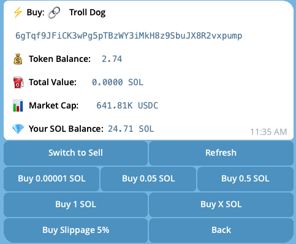
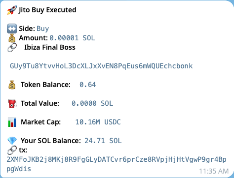
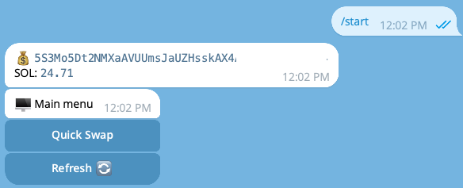

# Solana TG Zero-Fee Bot

Sick of per-trade fees eating your gains? Trade on Solana via Telegram with zero commissions. Fast swaps, minimal UI, self-hosted keys.

---

## ⚙️ Quick Start

1) **Clone & install**

    git clone https://github.com/codeorbit10/solana-tg-zero-fee-bot
    cd solana-tg-zero-fee-bot
    pip3 install -r requirements.txt

2) **Create a .env file with the following values**

    ### Telegram bot token (create a bot via BotFather: https://t.me/BotFather)
    TG_BOT_TOKEN="123456:ABC..."

    ### Solana RPC (public endpoint or your Helius free/paid URL)
    RPC_URL="https://api.mainnet-beta.solana.com"

    ### Trading wallet private key in Base58 (use a dedicated wallet)
    SOL_PRIVATE_KEY="base58_private_key_here"

3) **Run the bot**

    python3 -m tg.index

---

## ✅ Current Features
- Wallet balance header (quick overview)
- Quick Swap (buy/sell) flow

---

## 📸 Screenshots

  
  

  

---

## 🛣️ Roadmap
- **Hosted public bot**: use it without running your own server; keys stored safely in **AWS** (KMS / Secrets Manager)
- **Jito tip / priority fee** controls
- **Basic PnL** per token since first buy
- **Stops & targets**: stop-loss and take-profit (OCO), optional trailing stop
- **Positions list**: show all token accounts you hold, with values
- **Rug/flag hints** (freeze authority, supply anomalies)

---

## 🔐 Notes
- Use a **dedicated wallet** for trading.
- Keep your bot token and private key secret.

Questions or ideas? Open an issue or PR—this README will evolve as features land.
